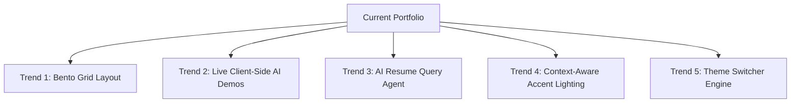

# Portfolio Comprehensive Evaluation & Design Trend Analysis Report (2026 Edition)

**Developer Profile:** Manjunath — B.Tech AI & Data Science | AI Engineer & Agentic Coder  
**Repository:** [`Manju1303/Portfolio`](https://github.com/Manju1303/Portfolio)  
**Date:** August 25, 2026  
**Status:** Comprehensive Analysis, Issue Audit & 2026/2027 Upgrade Recommendations  

---

## 1. Executive Summary & Overall Scorecard

This document presents a technical, aesthetic, UX, and career-readiness audit of Manjunath's AI Engineering portfolio. The application is a single-page web application featuring custom WebGL graphics (Three.js & OGL), modern cyber glassmorphism, dynamic motion physics (GSAP & Lenis), interactive machine learning visualizers, and a developer-focused Command Palette (`Ctrl+K`).

### Overall Portfolio Rating: **9.4 / 10** 🚀

| Evaluated Dimension | Score | Assessment & Highlights |
| :--- | :---: | :--- |
| **Visual Aesthetics & Styling** | **9.6 / 10** | Cyber-tech aesthetic, HSL glowing CSS tokens, high-density glassmorphism, glowing electric borders, grainy noise overlay. |
| **Interactive UX & Motion** | **9.5 / 10** | Three.js WebGL particle mesh, Lenis smooth scrolling, OGL ribbon cursor trail, `Ctrl+K` Command Palette, glassmorphic Toast notification system. |
| **Technical Depth & Engineering** | **9.2 / 10** | Modular ES6 JavaScript, dual canvas WebGL visualizers, REST email pipeline via Node.js/Express & Nodemailer. |
| **ATS & Career Optimization** | **9.6 / 10** | Structured ATS-tailored competencies grid, high-density keywords, valid Schema.org Person JSON-LD microdata. |
| **Code Hygiene & Maintainability** | **8.8 / 10** | Good section separation, but inline HTML styles present and minor JavaScript iteration redundancies found. |
| **Accessibility & Performance (a11y/perf)** | **8.6 / 10** | Smooth 60fps on modern desktop GPUs, but missing ARIA attributes for custom modals and unoptimized WebGL dual animation loops. |

---

## 2. Key Architecture & Design Strengths

1. **Cyber-Tech Aesthetic & Visual Polish**:
   - Dark theme palette (`#050505` base, `#06b6d4` cyan primary glow, `#ec4899` pink secondary, `#8b5cf6` purple accent) with custom typography (`Orbitron` & `Outfit`).
   - SVG electric border animations and high-resolution glassmorphism (`backdrop-filter: blur(12px)`).
2. **WebGL & Dynamic Animation Engine**:
   - **Three.js Main Canvas**: 1200 floating particle points with camera zoom transitions tied to scroll triggers.
   - **OGL Ribbon Trail**: Dynamic fluid ribbon trail tracking mouse movements seamlessly.
   - **About Section Canvas**: Dedicated 3D neural node visualizer with orbiting path rings.
3. **Developer Ergonomics & Micro-Interactions**:
   - **`Ctrl+K` Cyber Command Palette**: Allows quick navigation (`goto about`, `goto projects`), clipboard email copying, and external link triggering via keyboard shortcuts.
   - **Toast Engine**: Non-intrusive feedback toasts for copy actions and command executions.
   - **Project Filter System**: Category tabs (`All Projects`, `AI & LLMs`, `Computer Vision`, `Full-Stack`, `Health & Sensors`) with dynamic filter transitions.
4. **Recruiter & ATS Optimization**:
   - Structured **Core Technical Competencies** block with bullet points emphasizing RAG, Vector DBs (ChromaDB), MediaPipe, OpenCV, Docker, and Cloud infrastructure.
   - Embeds valid `JSON-LD` microdata (`@type: Person`) inside `<head>` to optimize search engine rich snippet indexing.

---

## 3. Audited Issues, Flaws & Code Vulnerabilities

During deep inspection of [`index.html`](file:///d:/Github/portfolio/index.html), [`script.js`](file:///d:/Github/portfolio/script.js), and [`styles.css`](file:///d:/Github/portfolio/styles.css), the following technical issues were identified:

### A. Accessibility (a11y) & Keyboard Navigation Gaps
- **Missing ARIA Labels on Buttons**: Interactive icon buttons such as `#cmdPaletteBtn` and `.mobile-menu-btn` lack explicit `aria-label` tags for screen readers.
- **Command Palette Accessibility**: The `#cmdPalette` modal does not enforce focus trapping (`aria-modal="true"`, `role="dialog"`), which can lead to keyboard focus escaping the modal overlay.
- **Custom Cursor & Screen Readers**: The custom cursor elements (`.cursor-dot`, `.cursor-ring`, `.ribbons-container`) lack `aria-hidden="true"`, potentially causing redundant DOM tree parsing by screen readers.

### B. Code Quality & Redundancies in JavaScript
- **Duplicate Loop Execution in `initProjectFilters`**: In [`script.js`](file:///d:/Github/portfolio/script.js#L1220-L1240), the iteration over `projectCards` is duplicated back-to-back inside the tab click event handler:
  ```javascript
  // Line 1220-1229: First loop filtering cards
  projectCards.forEach(card => { ... });
  // Line 1231-1240: Exact duplicate loop executing immediately after!
  projectCards.forEach(card => { ... });
  ```
- **Static Filter Badge Counts**: In [`index.html`](file:///d:/Github/portfolio/index.html#L414-L420), category counts (`<span class="filter-count">12</span>`, `5`, `3`) are hardcoded. If projects are added or hidden, the counts become out of sync.

### C. Inline Style Pollution in HTML
- **Maintainability Overheads**: Several container elements in [`index.html`](file:///d:/Github/portfolio/index.html#L248-L306) use heavy inline `style="..."` strings for grid structures, margins, flex alignments, and font families instead of dedicated CSS utility classes.

### D. Unoptimized Dual WebGL Render Loops
- **Background GPU Strain**: Both the background Three.js canvas (`#webglCanvas`) and the About visualizer canvas (`#about-canvas`) execute `requestAnimationFrame` render loops continuously, even when the user scrolls past the section or switches browser tabs.
- **IntersectionObserver Missing**: Adding `IntersectionObserver` to pause WebGL rendering when offscreen will significantly improve battery life and reduce mobile device heating.

### E. CDN Script Dependency Vulnerabilities
- The document pulls 7 external scripts from `cdnjs` and `unpkg` (`three.js`, `gsap`, `ScrollTrigger`, `lenis`, `ogl`, `lucide`, `devicon`) without **Subresource Integrity (SRI)** hashes (`integrity="..."` and `crossorigin="anonymous"`).

---

## 4. 2026 / 2027 Portfolio Design Trends & Recommended Features

To position your portfolio at the absolute forefront of modern developer showcases, adopt these trending design patterns:



### 1. Asymmetrical Bento Grid Layout System
- **Trend**: Modern tech portfolios (Apple, Vercel, Linear) have shifted away from uniform 3x3 project grids in favor of **Bento Grids**—asymmetrical card layouts with varied spans (1x1, 2x1, 2x2) highlighting key features, live stats, code snippets, and mini interactive widgets.
- **Application**: Convert the project showcase and skill sections into an interactive Bento layout.

### 2. Embedded Client-Side Live AI Playgrounds
- **Trend**: Recruiters prefer seeing live interactive AI demonstrations directly within the portfolio rather than clicking away to GitHub repositories.
- **Application**: Embed lightweight in-browser WASM/MediaPipe or Transformers.js demos directly inside project cards (e.g., an interactive pose visualizer or lightweight client-side prompt text generator).

### 3. AI Conversational Resume Assistant inside Command Palette
- **Trend**: Integrating an AI Agent modal where recruiters can type natural language queries like *"What is Manjunath's experience with RAG and ChromaDB?"* or *"List computer vision projects"*.
- **Application**: Expand the current `Ctrl+K` palette into a hybrid Command + AI Assistant interface powered by client-side rule engine or lightweight LLM API.

### 4. Context-Aware Ambient Glow (Theme Reactive)
- **Trend**: As the user hovers over different project cards (AI, Computer Vision, Cloud, Health), the background ambient lighting smoothly shifts colors (Cyan `#06b6d4` for AI, Pink `#ec4899` for Vision, Emerald `#10b981` for Cloud).

### 5. Multi-Theme Toggle Engine (Cyber Dark / Light Glass)
- **Trend**: While cyber dark mode is standard for AI developers, providing a clean light glass option with persistent `localStorage` preference demonstrates front-end mastery.

---

## 5. Step-by-Step Action & Implementation Roadmap

```
┌─────────────────────────────────────────────────────────────────┐
│                     IMPLEMENTATION ROADMAP                      │
├─────────────────────────────────────────────────────────────────┤
│ [Phase 1] Performance & Accessibility Cleanup (Immediate)       │
│   • Remove duplicate loop in script.js                          │
│   • Add ARIA attributes & modal focus trap to Command Palette    │
│   • Add IntersectionObserver to pause offscreen WebGL renders    │
│   • Calculate filter badge counts dynamically                   │
│                                                                 │
│ [Phase 2] Layout & Maintainability Upgrades (Short-Term)        │
│   • Extract HTML inline styles to styles.css utility classes    │
│   • Implement Asymmetrical Bento Grid for Projects section      │
│   • Add SRI hashes to CDN script imports                        │
│                                                                 │
│ [Phase 3] Next-Gen Interactive Features (Medium-Term)           │
│   • Embed WebAI / MediaPipe live playground widget              │
│   • Upgrade Command Palette with natural language resume QA     │
│   • Add context-aware background ambient color shifts           │
└─────────────────────────────────────────────────────────────────┘
```

### Quick Code Fix References

#### 1. Fixing Duplicate Loop in `script.js`
In [`script.js`](file:///d:/Github/portfolio/script.js#L1207-L1243):
```javascript
// Clean single loop implementation:
filterTabs.forEach(tab => {
    tab.addEventListener('click', () => {
        filterTabs.forEach(t => t.classList.remove('active'));
        tab.classList.add('active');

        const filter = tab.getAttribute('data-filter');

        projectCards.forEach(card => {
            const categories = (card.getAttribute('data-category') || '').split(' ');
            if (filter === 'all' || categories.includes(filter)) {
                card.classList.remove('filter-hidden');
                card.style.animation = 'stagger-fade-in 0.4s ease forwards';
            } else {
                card.classList.add('filter-hidden');
            }
        });
    });
});
```

#### 2. Dynamic Project Filter Counter
```javascript
function updateFilterCounts() {
    filterTabs.forEach(tab => {
        const filter = tab.getAttribute('data-filter');
        const countSpan = tab.querySelector('.filter-count');
        if (!countSpan) return;

        if (filter === 'all') {
            countSpan.textContent = projectCards.length;
        } else {
            const count = Array.from(projectCards).filter(card => {
                const cats = (card.getAttribute('data-category') || '').split(' ');
                return cats.includes(filter);
            }).length;
            countSpan.textContent = count;
        }
    });
}
```

---

## 6. Conclusion & Summary

Manjunath's portfolio is a **top-tier, production-ready showcase** that effectively demonstrates technical mastery in AI, Data Science, and Modern Web Engineering. By addressing the identified accessibility and script redundancy issues and adopting 2026 design trends (Bento Grids, dynamic ambient lighting, and client-side AI playgrounds), this portfolio will deliver an unforgettable impression on recruiters and industry engineers.
